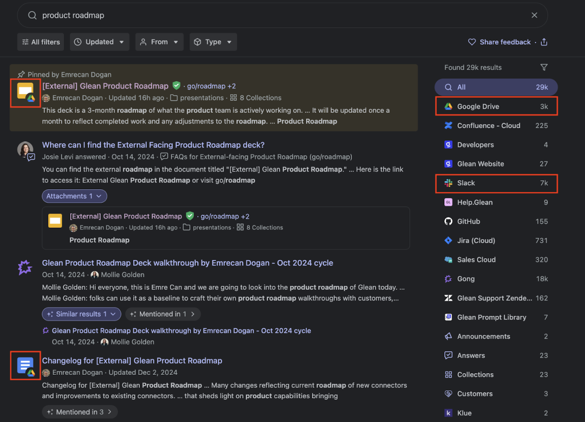
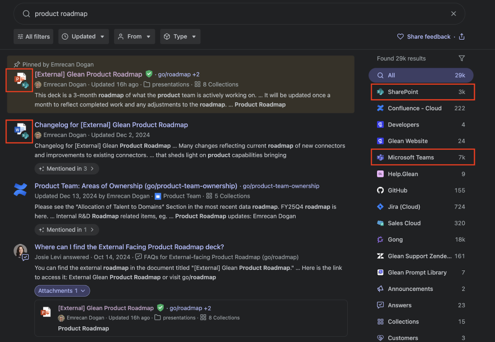

# microsoft-mode

A Chrome plugin that updates Google apps & Slack in SERP to show as Microsoft in SERP.

## What is Microsoft Mode?

This Chrome extension modifies search results to display Google apps and Slack as Microsoft products in the search engine results page (SERP).

### Before:


### After:


## How to Install the Chrome Extension

Follow these steps to install the extension manually in Chrome:

### Step 1: Download and Extract the File

1. Download the ZIP file linked [here](#).
2. Right-click the ZIP file and select "Extract All" (Windows) or "Unzip" (Mac).
3. Save the extracted folder somewhere you can find it easily.

### Step 2: Enable Developer Mode in Chrome

1. Open Google Chrome.
2. In the address bar, type: 
```
chrome://extensions/
```

and press Enter.
3. In the top-right corner, toggle on "Developer mode".

### Step 3: Load the Extension

1. Click "Load unpacked" (a button near the top of the page).
2. Select the extracted folder from Step 1.
3. The extension should now appear in Chrome.

### Step 4: Use the Extension

1. Open Glean
2. Click the puzzle piece icon in the top-right of Chrome.
3. Find the extension in the list and turn on Enable Microsoft Mode

That's it! 🎉 The extension is now installed.